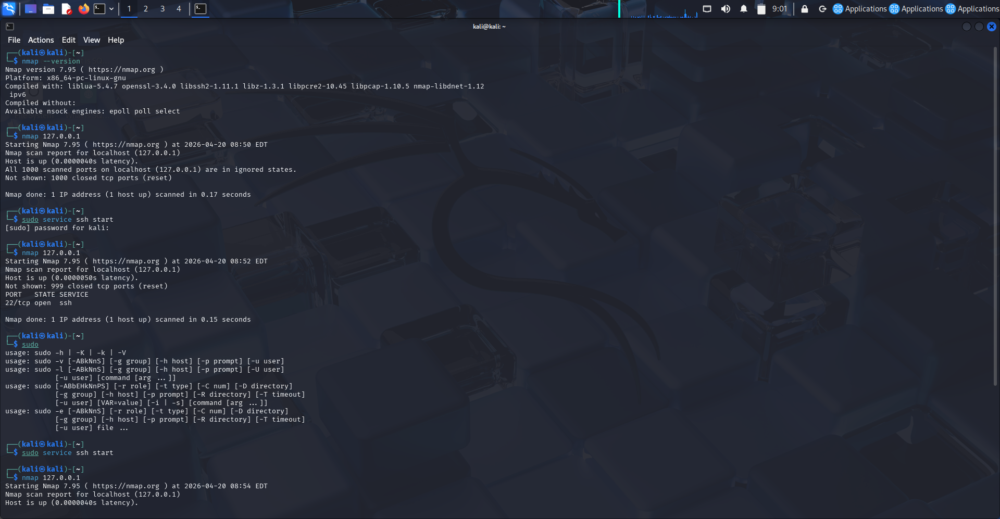
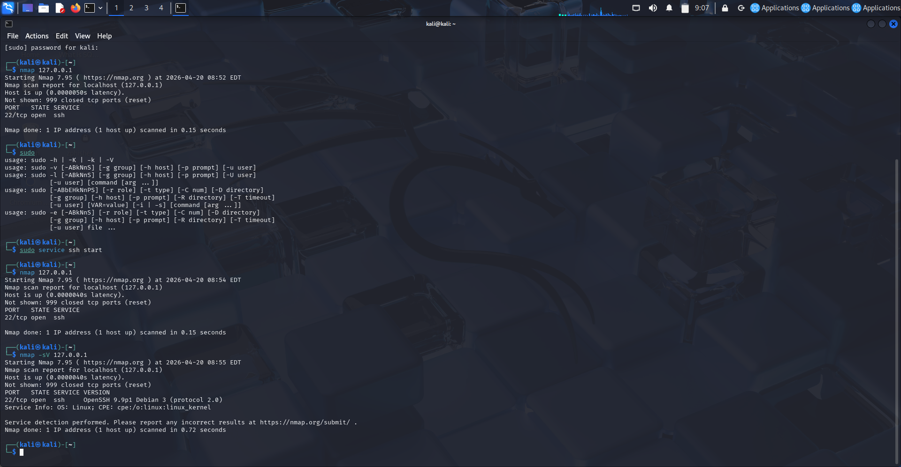

# 🔐 Network Scanning and Service Enumeration using Nmap

## 📌 Overview
This project demonstrates network scanning and service enumeration using Nmap in a Kali Linux virtual lab environment. The objective was to understand how systems expose network services and how they can be analyzed from a security perspective.

---

## 🧪 Scenario
A local system (127.0.0.1) was analyzed to identify open ports and running services. Initially, all ports were closed. After enabling the SSH service, an open port was detected and further analyzed using service version detection.

---

## ⚙️ Tools Used
- Kali Linux  
- Nmap  

---

## 🚀 What I Did
- Performed an initial scan on localhost (127.0.0.1)  
- Observed all ports in a closed state  
- Enabled SSH service to simulate an active service  
- Identified open port (22/tcp)  
- Conducted service version detection using Nmap (`-sV`)  

---

## 📸 Screenshots

### 🔹 Initial Scan (All Ports Closed)

### 🔹 Open Port & Service Detection

---

## 🧠 Key Findings
- Initially, no open ports were detected  
- After enabling SSH, port 22/tcp was identified as open  
- Service version detection revealed the running service (OpenSSH)  
- Demonstrates how exposed services can be discovered during reconnaissance  

---

## 🧠 Key Learnings
- How port scanning identifies open and closed ports  
- How services running on open ports can be enumerated  
- Basics of reconnaissance in network security  
- Importance of monitoring exposed services  

---

## ⚠️ Disclaimer
This project was performed in a controlled lab environment for educational purposes only.
